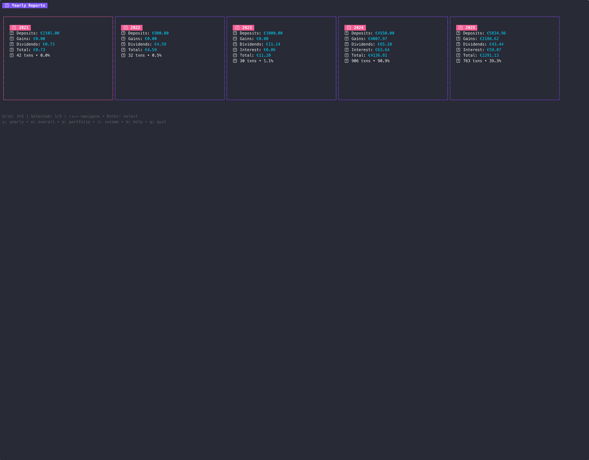

# T212 Taxes 📊

> A comprehensive Go application for processing Trading 212 CSV exports and calculating tax obligations with modern tooling and beautiful UI.

[](hhttps://github.com/Lizzergas/go-t212-taxes/actions)
[](https://goreportcard.com/report/github.com/Lizzergas/go-t212-taxes)
[](https://codecov.io/gh/Lizzergas/go-t212-taxes)
[](https://opensource.org/licenses/MIT)
[](https://github.com/Lizzergas/go-t212-taxes)
[](https://github.com/Lizzergas/go-t212-taxes/releases)
[](https://github.com/Lizzergas/go-t212-taxes/pkgs/container/go-t212-taxes)

## ✨ Demo



*Interactive TUI with portfolio navigation, real-time calculations, and browser integration*

## 🚀 Features

### 📊 **Comprehensive Analysis**
- **CSV Processing**: Parse and validate Trading 212 export files with robust error handling
- **Tax Calculations**: Calculate capital gains, dividends, and tax obligations for multiple jurisdictions
- **Portfolio Valuation**: Real-time portfolio analysis with market values and P&L tracking
- **Income Reports**: Detailed dividend and interest analysis with withholding tax calculations

### 🎨 **Modern Interface**
- **Beautiful TUI**: Interactive terminal UI built with Bubble Tea and Lip Gloss
- **Scrollable Portfolio**: Navigate through positions with arrow keys and cursor highlighting
- **Browser Integration**: Open Yahoo Finance quotes directly from the TUI (Enter key)
- **Responsive Design**: Adapts to terminal size with smart scrolling

### 🔧 **Developer Experience**
- **Type Safety**: Comprehensive struct validation and error handling
- **CLI Tool**: Feature-rich command-line interface with Cobra
- **Testing**: Extensive test suite with >90% coverage
- **Performance**: Optimized for handling large CSV files

### 🌍 **Multi-Platform**
- **Cross-Platform**: Windows, macOS, and Linux support
- **Docker**: Containerized deployment available
- **CI/CD**: Automated testing, building, and releases

## 📥 Installation

### Pre-built Binaries

Download the latest release for your platform:

```bash
# macOS (Apple Silicon)
curl -L https://github.com/Lizzergas/go-t212-taxes/releases/latest/download/go-t212-taxes-darwin-arm64 -o t212-taxes
chmod +x t212-taxes

# macOS (Intel)
curl -L https://github.com/Lizzergas/go-t212-taxes/releases/latest/download/go-t212-taxes-darwin-amd64 -o t212-taxes
chmod +x t212-taxes

# Linux (x64)
curl -L https://github.com/Lizzergas/go-t212-taxes/releases/latest/download/go-t212-taxes-linux-amd64 -o t212-taxes
chmod +x t212-taxes

# Windows (x64)
curl -L https://github.com/Lizzergas/go-t212-taxes/releases/latest/download/go-t212-taxes-windows-amd64.exe -o t212-taxes.exe
```

### Go Install

```bash
go install github.com/Lizzergas/go-t212-taxes/cmd/go-t212-taxes@latest
```

### Docker

```bash
# Run directly
docker run --rm -v $(pwd)/exports:/app/data ghcr.io/Lizzergas/go-t212-taxes:latest analyze --dir /app/data

# Interactive mode
docker run --rm -it -v $(pwd)/exports:/app/data ghcr.io/Lizzergas/go-t212-taxes:latest
```

### From Source

```bash
git clone https://github.com/Lizzergas/go-t212-taxes.git
cd t212-taxes
go build -o t212-taxes ./cmd/t212-taxes
```

## 🎯 Quick Start

### 1. Export Your Data
Export your Trading 212 data as CSV files using the format: `from_YYYY-MM-DD_to_YYYY-MM-DD_[hash].csv`

### 2. Interactive Analysis
```bash
# Launch interactive TUI
./t212-taxes analyze --dir ./exports

# Navigate with:
# y - Yearly reports
# p - Portfolio view  
# i - Income analysis
# ↑↓ - Navigate positions
# Enter - Open Yahoo Finance quotes
```

### 3. Command Line Reports
```bash
# Process files and generate reports
./t212-taxes process --dir ./exports

# Portfolio analysis
./t212-taxes portfolio --dir ./exports

# Income analysis  
./t212-taxes income --dir ./exports

# Export to JSON
./t212-taxes portfolio --dir ./exports --format json --output portfolio.json
```

## 🎮 TUI Controls

| Key | Action |
|-----|--------|
| `y` | View yearly reports |
| `p` | Portfolio analysis |
| `i` | Income reports |
| `o` | Overall summary |
| `h` | Help screen |
| `↑↓` | Navigate positions |
| `Enter` | Open stock quote in browser |
| `e/x` | Expand/collapse portfolio |
| `b` | Go back |
| `q` | Quit |

## 🏗️ Architecture

This project follows **Clean Architecture** principles:

```
├── cmd/t212-taxes/          # Application entry point
├── internal/
│   ├── app/                 # Application layer
│   │   ├── cli/            # CLI commands and handlers
│   │   ├── config/         # Configuration management
│   │   └── tui/            # Terminal UI components
│   ├── domain/             # Business logic
│   │   ├── calculator/     # Tax calculation engines
│   │   ├── parser/         # CSV parsing and validation
│   │   └── types/          # Core domain types
│   ├── infrastructure/     # External concerns
│   │   ├── csv/           # CSV file handling
│   │   ├── logger/        # Logging implementation
│   │   └── storage/       # Data persistence
│   └── pkg/               # Shared utilities
├── data/sample/            # Example CSV files
├── docs/                   # Documentation
└── scripts/               # Build and deployment scripts
```

### Key Design Patterns
- **Dependency Injection**: All dependencies injected through interfaces
- **Repository Pattern**: Abstract data access with pluggable implementations
- **Strategy Pattern**: Different tax calculation strategies for various jurisdictions
- **Command Pattern**: CLI commands with consistent structure

## 📊 Supported Calculations

### Tax Jurisdictions
- **🇺🇸 United States**: Federal tax calculations with state considerations
- **🇬🇧 United Kingdom**: Capital gains and dividend tax with allowances
- **🇪🇺 European Union**: General EU tax framework
- **🇧🇬 Bulgaria**: Local tax rules and regulations

### Transaction Types
- Market orders (buy/sell)
- Limit orders
- Stop orders  
- Dividend payments
- Interest payments
- Deposits and withdrawals

### Features
- Capital gains/losses with FIFO/LIFO methods
- Dividend tax calculations with withholding tax credits
- Wash sale rule applications
- Multi-currency support with exchange rate handling
- Tax year boundary handling
- Detailed audit trails

## ⚙️ Configuration

### Configuration File (`config.yaml`)
```yaml
app:
  log_level: "info"
  output_format: "table"

tax:
  default_jurisdiction: "US"
  default_year: 2024
  use_fifo_method: true

csv:
  delimiter: ","
  skip_invalid_rows: true
  date_format: "2006-01-02 15:04:05"
```

### Environment Variables
```bash
export T212_LOG_LEVEL=debug
export T212_TAX_JURISDICTION=UK
export T212_CSV_DELIMITER=";"
```

### Command Line Flags
All configuration options can be overridden via command line flags.

## 🧪 Development

### Prerequisites
- Go 1.21 or later
- Make (optional, for convenience commands)

### Setup
```bash
# Clone repository
git clone https://github.com/Lizzergas/go-t212-taxes.git
cd t212-taxes

# Install dependencies
go mod download

# Run tests
go test ./...

# Run with coverage
go test -v -race -coverprofile=coverage.out ./...
go tool cover -html=coverage.out

# Build
go build -o t212-taxes ./cmd/t212-taxes
```

### Code Quality
```bash
# Format code
go fmt ./...

# Lint (requires golangci-lint)
golangci-lint run

# Security scan
gosec ./...

# Run benchmarks
go test -bench=. ./...
```

### Testing Strategy
- **Unit Tests**: Test individual functions and methods
- **Integration Tests**: Test component interactions
- **Table-Driven Tests**: Comprehensive test cases with multiple scenarios
- **Benchmark Tests**: Performance testing for critical paths
- **Golden File Tests**: Snapshot testing for complex outputs

## 📈 Performance

- **Streaming Processing**: Handle large CSV files without loading everything into memory
- **Concurrent Processing**: Utilize goroutines for CPU-intensive calculations
- **Memory Optimization**: Efficient data structures and garbage collection awareness
- **Caching**: Cache exchange rates and frequently accessed data

## 🔒 Security

- Input validation for all user-provided data
- Secure handling of financial information
- No storage of sensitive data in logs
- Configuration file security best practices
- Dependency vulnerability scanning via CI/CD

## 🤝 Contributing

We welcome contributions! Please see our [Contributing Guide](CONTRIBUTING.md) for details.

### Development Workflow
1. Fork the repository
2. Create a feature branch (`git checkout -b feature/amazing-feature`)
3. Make your changes following our coding standards
4. Add tests for new functionality
5. Run the full test suite (`go test ./...`)
6. Format your code (`go fmt ./...`)
7. Commit your changes (`git commit -m 'Add amazing feature'`)
8. Push to the branch (`git push origin feature/amazing-feature`)
9. Open a Pull Request

### Coding Standards
- Follow Go best practices and idioms
- Use meaningful variable and function names
- Write comprehensive tests for new functionality
- Document public APIs with Go doc comments
- Keep functions small and focused
- Use interfaces for abstraction
- Handle errors explicitly and appropriately

## 📝 License

This project is licensed under the MIT License - see the [LICENSE](LICENSE) file for details.

## 🙏 Acknowledgments

- **[Bubble Tea](https://github.com/charmbracelet/bubbletea)** - The TUI framework
- **[Lip Gloss](https://github.com/charmbracelet/lipgloss)** - Terminal styling
- **[Cobra](https://github.com/spf13/cobra)** - CLI framework
- **[Viper](https://github.com/spf13/viper)** - Configuration management

## 📞 Support

- **Issues**: Report bugs and feature requests on [GitHub Issues](https://github.com/Lizzergas/go-t212-taxes/issues)
- **Discussions**: Join our [GitHub Discussions](https://github.com/Lizzergas/go-t212-taxes/discussions)
- **Documentation**: Comprehensive documentation in the [`docs/`](docs/) directory

## 🗺️ Roadmap

- [ ] Web interface for non-technical users
- [ ] API server mode for integration with other tools
- [ ] Additional tax jurisdictions (Canada, Australia, Germany)
- [ ] Real-time exchange rate integration
- [ ] Advanced reporting and visualization
- [ ] Plugin system for custom calculations
- [ ] Database storage for historical data
- [ ] Multi-user support with authentication

---

⚠️ **Disclaimer**: This tool provides estimates for informational purposes. Always consult a tax professional for official tax advice.
